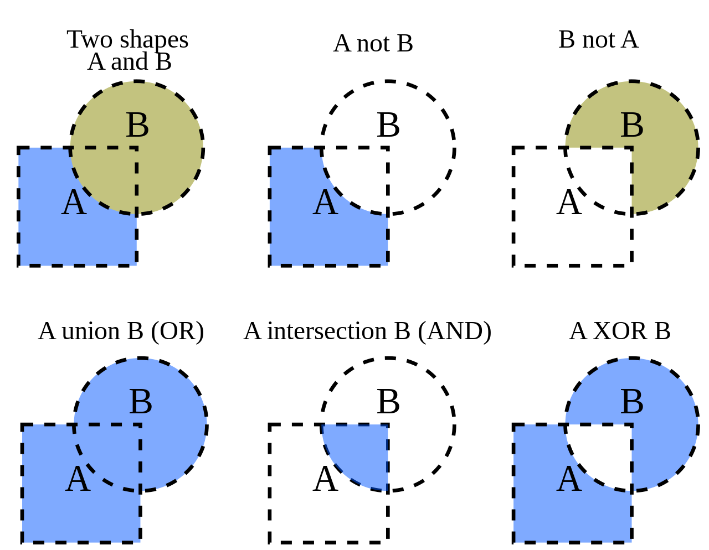
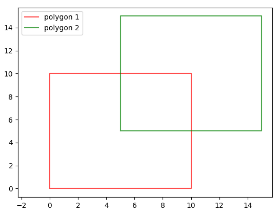

# Boolean Operations on Polygons

## Basic Information
Boolean operations on polygons are a set of Boolean operations (AND, OR, NOT, XOR, ...) operating on 2d plane.



## Problem to solve
There are lots of previous algorithms providing solutions in the field of polygons' boolean operations, such as Sutherland–Hodgman algorithm, Weiler–Atherton algorithm, Vatti algorithm, or Greiner–Hormann algorithm. Unfortunately, the problem is most of them have own limitations.

| Algorithm | Limitation |
| :---: | --- |
| Sutherland–Hodgman | can't handle concave polygon |
| Weiler–Atherton | can't handle concave polygon |
| Vatti | slower than Greiner-Hormann |
| Greiner–Hormann | can't handle coincident edges, vertices |

The target for this porject is to make a robust library which can dealing with different types of input. Users may not be worried about convex or concave polygon problems. I will also try to improve the performance as well.

## Prospective Users
These sets of operations are widely used in computer graphics, GIS, CAD, and EDA (in integrated circuit physical design and verification software).

## Api Description
In this project, `and`, `or` `different` polygon operations were implemented. I provided both C++ and Python API. 
Found more details in [API document](document/api.md).

## Correctness Testing
For checking correctness of algorithm, I made both fuzz test and manaul test. 
Found more details in [Test document](document/test.md).

## Performance
I compared the efficiency with boost library.
Found more details in [Performance document](document/performance.md).

## Visualization
I created a script to help the result visualization. You may import the file to use.
```sh
# demo command
$ cd code
$ python3 visualization_tool/visualize.py
```



## Makefile Command
```sh
$ cd code
$ make polygon      # compiled python library
$ make c_demo       # run c++ demo
$ make py_demo      # run python demo with visualization
$ make fuzz_test    # run fuzz test
$ make speed_test   # run speed comparison with boost
$ make clean        # clean
```

## Limit
Cannot deal with self-made hole in one polygon yet.