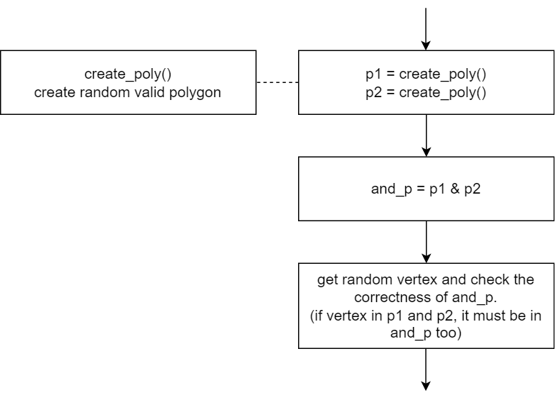
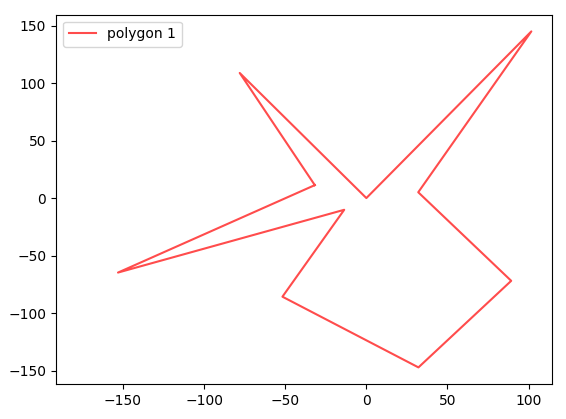
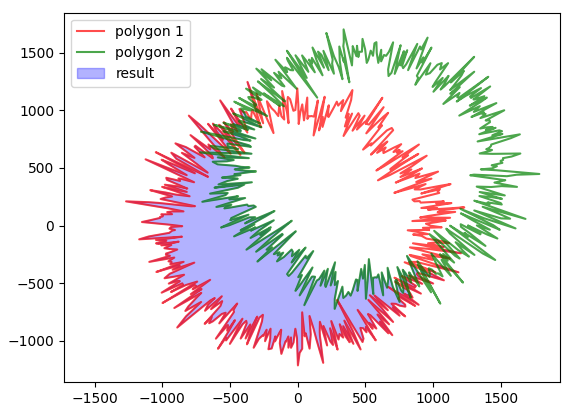
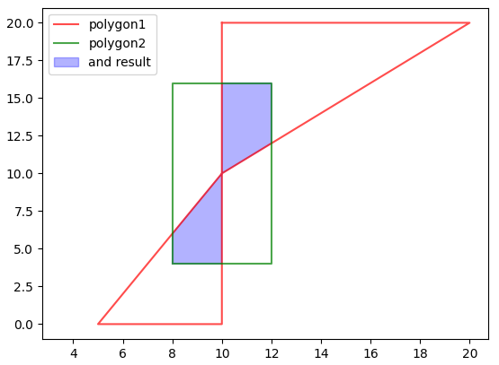
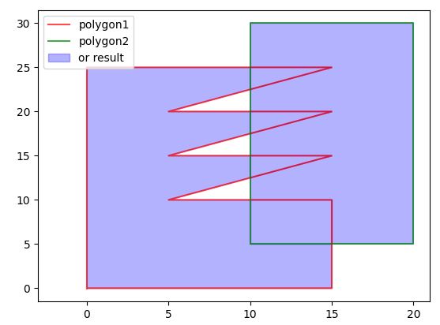
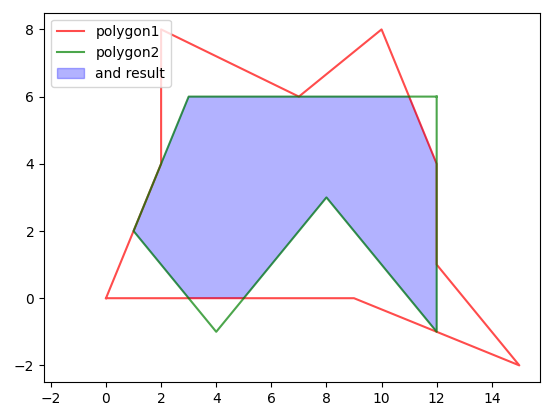
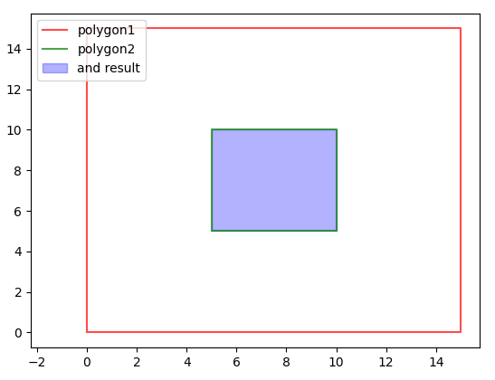
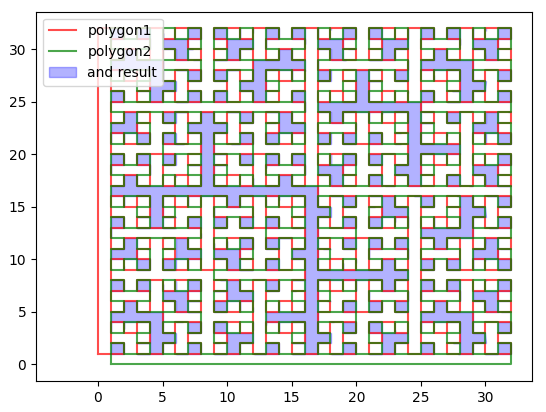

# Fuzz Test & Manaul Test

## Fuzz Test
- Command
  ```sh
  $ cd code
  $ make fuzz_test
  ```
- It's both hard to get polygons dataset and check the result, so fuzz test might be a good way to test the correctness.
- The procedure of fuzz test

  
- The algorithm to create polygon
  - According to the algorithm mentioned on [stackoverflow](https://stackoverflow.com/questions/8997099/algorithm-to-generate-random-2d-polygon), I  rewrited it in c++.
  - To be short, the algorithm creates a circle first, and then modifies the vertices. The polygon can be guaranteed that self-intersection doesn't exist.

  
- Fuzz Test Performance
  | Number of Test | Vertex Number of Polygon | Number of Intersecion | Random Vertex for Checking | Status |
  | --- | --- | --- | --- | --- |
  | 1000 times | 200 | around 40 | 10000 | passed |
  | 500 times | 500 | around 180 | 10000 | passed |
  | 100 times | 1000 | around 650 | 10000 | passed |

  

## Manaul Test
- Command
  ```sh
  $ cd code
  $ make py_demo
  ```
- Create and test special testcases depend on domain knowledge.
- Some Special Situations (put in [testcase](../code/testcase) folder)
  - self-intersection
  
    
  - polygons with holes

    
  - coincidence point and coincidence edge
  
    
  - one in another polygon
  
    
  - complex polygon

    